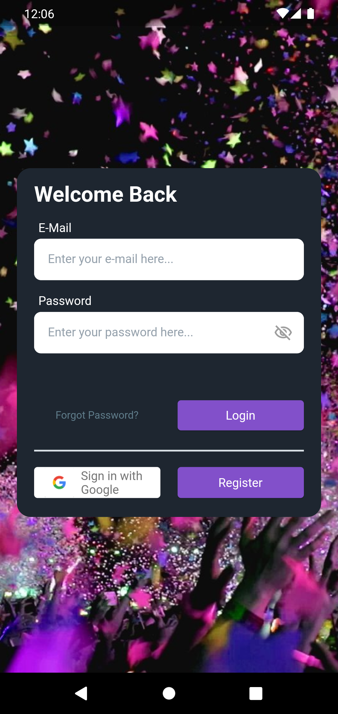
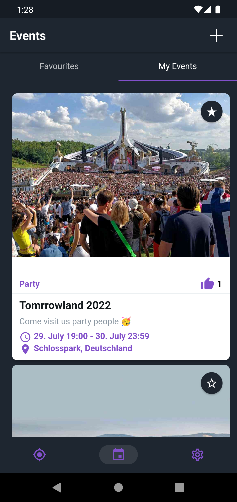
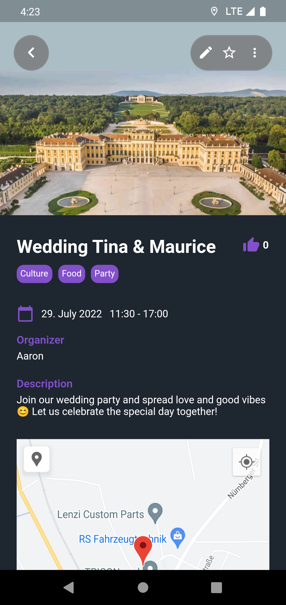
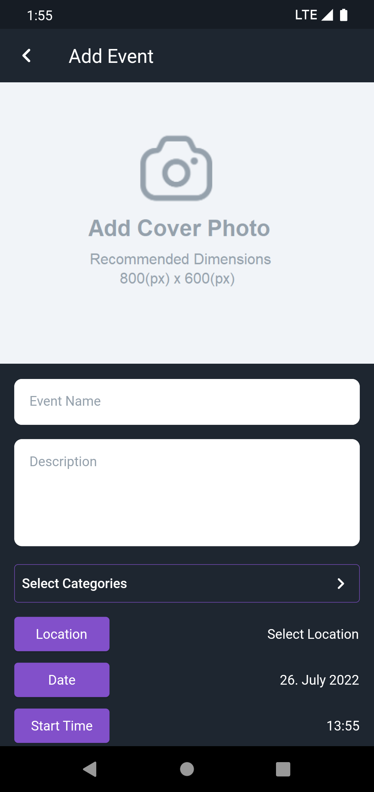
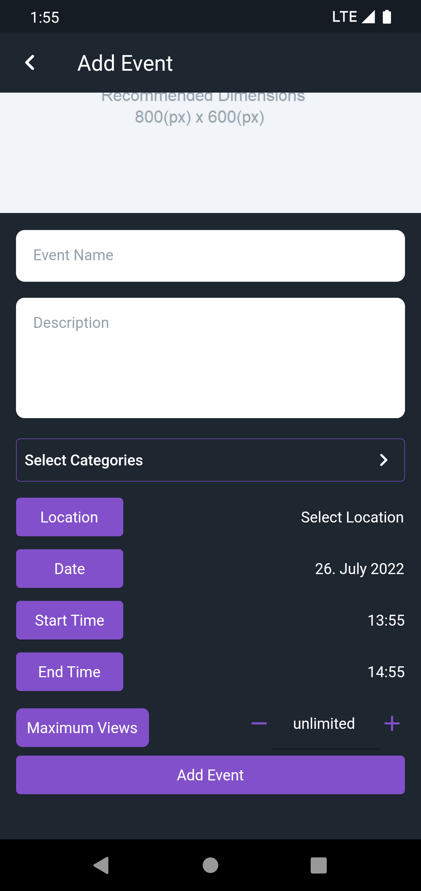

# Nxt2Me - EventApp
Nxt2Me is a Flutter Application to find events based on your location and interests.

 
It was developed as a group project at the University of Kassel.
This is the Frontend repository of the app. You can find the corresponding Backend [here](https://github.com/NiklasRitter/Nxt2Me_Backend).

## Features
- Login / Register
    - With email and password
    - Social Login with Google
    - Auto Login
    - Forgot Password
- Explore Events
    - Filter for distance, categories and date
    - Read and write comments
    - Like count
    - Push notifications
- Create own Events
    - Picture, name, description, categories, location, date range, max views
    
- Offline Mode
 
    
## Usage
We developed a corresponding [Nxt2Me_Backend](https://github.com/NiklasRitter/Nxt2Me_Backend) for this frontend.
To test the Nxt2Me application, you have to clone both repositories.

## Screenshots

| Login Page         | Overview of Events | Details Page       | Add Event Pages |
| ------------ | --- | ---------- | ---------- |
|   |   |    |    |

[More Screenshots here]( https://github.com/NiklasRitter/Nxt2Me_Frontend/tree/main/event_app/assets/images) 

## Authors and acknowledgment
This project was developed as a university group project. 
Group members: [Aaron](https://github.com/AaronWagener), [Eric](https://github.com/EricRode), [Niklas](https://github.com/NiklasRitter)
